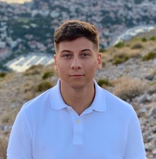

# Kirill Kolchanov



## **Contact information** 📲
- Email: kirill.kolchanov.work@gmail.com
- Discord: Kirill Ko
- GitHub: @KirillKolcanov

___

## **About me** 🙋🏽‍♂️
*I want to possess all the skills of frontend programming and move further as an experienced professional. Having a great desire to constantly learn new things and help other people in this direction.*

**Strengths** 💪🏼: entrepreneurial spirit, energy, optimism, sociability, desire to help people.

**Current location 🌎:**  *I moved from Minsk to Warsaw in 2020 and I am studying at the second year in the university at the specialty "Project Management".*

___

## Programming skills 🤔

+     using HTML, CSS, and JS for educational purposes.
+     Knowledge of adaptive layout
+     Using the "BAM" methodology
+     Skills of the GIT system
+     Basic knowledge of SQL
+     Writing a project using the React framework

___

## Code example from codewars 🤺
```
function toCamelCase(str){

  if (str === "") {
    return ""
  }

  const newStr = str.split(/[_-]/);

  if (newStr[0][0] != newStr[0][0].toUpperCase()) {
    return newStr[0] + (newStr.slice(1).map(word => word[0].toUpperCase() + word.substr(1))).join("")
  } else

  return  (newStr.map(word => word[0].toUpperCase() + word.substr(1))).join("")
}
```
___

## **Job experience** 👨🏽‍💻

* Worked in a logistics company as a system administrator.
+ Managed my own entertainment business.
+ Participated in two start-ups, where I performed different roles and solved many tasks. One of the directions was: AR-development.

___

## **Education** 📖

In 2021 I took a frontend course at TeachMeSkills.

Performed a joint project on the React framework:
https://github.com/DmitryKremenetsky/movie-search

Studied at the sites FreeCodeCamp and CodeAcademy, read the tutorial learn.javascript.ru.
Continuing assignments on codewars

___

## **English level** 🏴󠁧󠁢󠁥󠁮󠁧󠁿
## B2

*I am studying at university in my second year in English language. For admission I used the international certificate IELTS with the level of B2.
I studied constantly on the courses in Minsk, with Russian-speaking teachers, as well as with active speakers. Constantly learning and improving my knowledge.*


